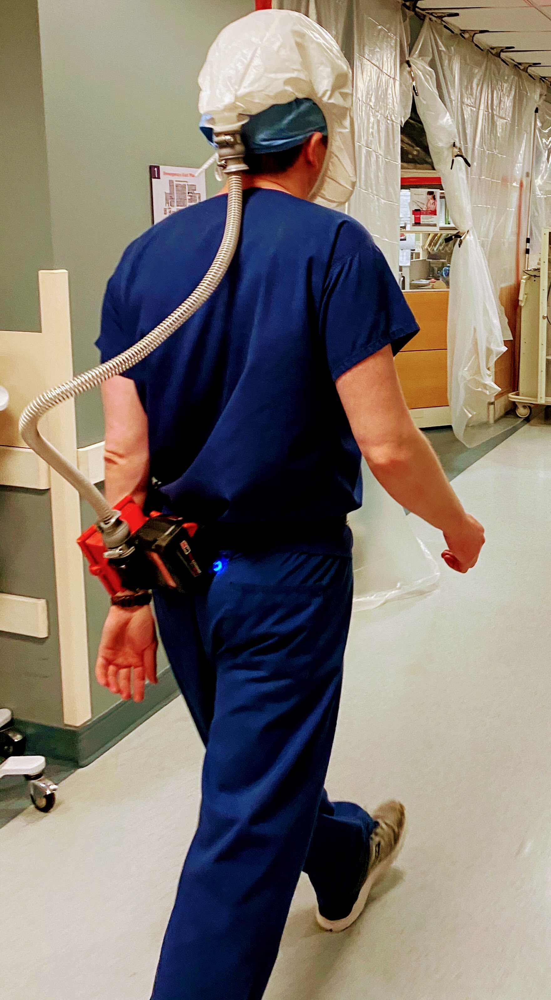
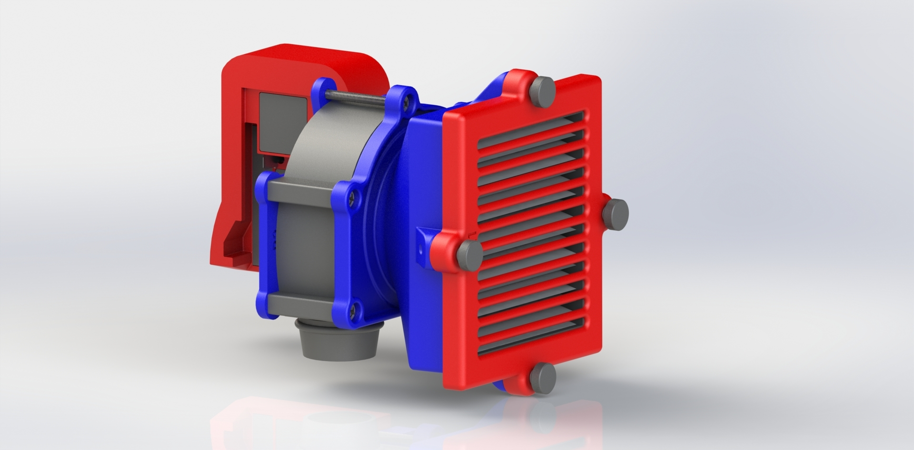
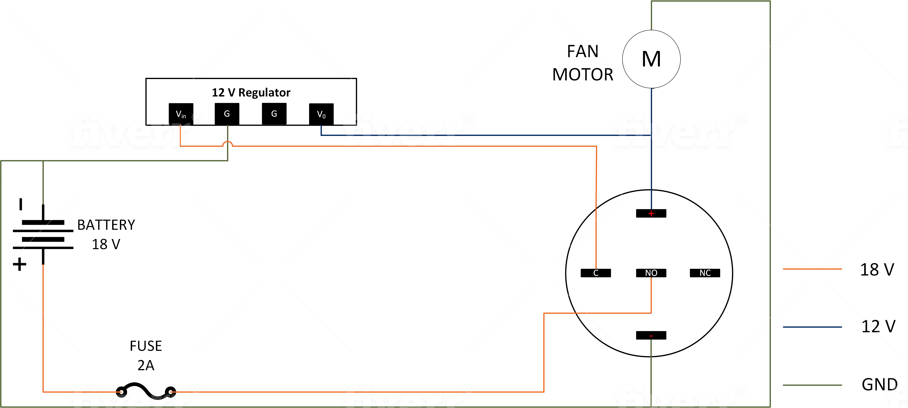

# OpenSourcePAPR
A powered, air purifying respirator.

## Overview
The device is intended to be connected to a wide variety of off-the-shelf reusable or disposable PAPR hoods from an existing systems. Filtered air is fed into the hood through a 3D printed, belt-mounted assembly. 

The assembly is composed of:

* An off-the-shelf P100 filter made from readily-sourced HEPA filters (see Parts List, below)
* An airtight fan intake manifold assembly
* An off-the-shelf 12V centrifugal fan rated for a minimum of 15 cfm at 12V
* A battery receiver that accepts the ubiquitous Milwaukee M18 18V Li-Ion battery
* A high-quality voltage 12V regulator from Polou
* A protective fuse

The goal is to provide a minimum 10 CFM of filtered air supply at all times to provide positive pressure in the hood. A requirement is that the battery needs to last 8 hours. We have validated the design using established NIOSH procedures for field testing respirators as well as quantitative particulate and air velocity testing.

## Parts List

## Wiring

